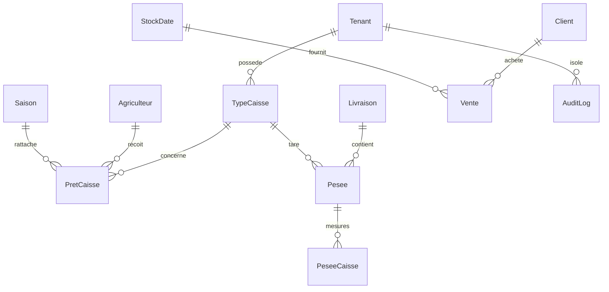

# Phase 1 — Audit du module Stock de Caisses

Date de l'audit : 7 septembre 2026  
Périmètre : Prisma, multi-tenant, stocks de caisses, prêts, retours par pesée, ventes, audit, RBAC, pagination et migrations existantes.

## 1. Résumé exécutif

Le projet est déjà structuré en couches `page/action/service/repository`, utilise un `tenantId` issu de la session, possède un RBAC centralisé et sait exécuter plusieurs workflows dans des transactions Prisma. Il ne faut donc pas créer une architecture parallèle.

Le stock de caisses actuel est toutefois un stock unique porté directement par `TypeCaisse.stockDisponible`. Il représente implicitement les caisses de la Wakala et ne distingue ni le propriétaire, ni les réceptions clients, ni les mouvements. Les modèles demandés pour la propriété des caisses n'existent pas encore.

La cible nécessite une évolution additive et un backfill : le stock existant de chaque `TypeCaisse` doit devenir le stock initial appartenant à la Wakala. Aucun historique client ne peut être reconstruit à partir des données présentes.

Avant cette évolution, deux défauts transactionnels critiques doivent être pris en compte dans le design : les sorties de stock des prêts et des ventes ne sont pas protégées contre deux décréments concurrents, et le retour manuel d'un prêt appelle actuellement la mise à jour du prêt hors de la transaction ouverte.

## 2. Stack et conventions réellement trouvées

- Next.js **16.3.1** App Router, et non Next.js 15.
- React 19, TypeScript strict, Prisma 7.9 avec adaptateur Neon.
- Auth.js v5 beta et session JWT contenant le `tenantId` actif et le rôle du membre dans cette Wakala.
- Server Actions validées avec Zod.
- Services responsables du RBAC et de la logique métier.
- Repositories majoritairement filtrés par `tenantId`.
- Audit générique centralisé dans `AuditLog`.
- Pagination/tri serveur réutilisable dans `src/lib/pagination.ts`.
- Saisons avec une seule saison ouverte par tenant et bilans versionnés.

Le contrôle de migration en ligne (`prisma migrate status`) n'a pas pu aboutir pendant l'audit, car la connexion Neon était indisponible. Le schéma et tous les fichiers de migration locaux ont bien été inspectés, mais l'état réellement appliqué en base devra être vérifié avant la phase migration.

## 3. Modèle actuel des caisses



### `TypeCaisse`

`TypeCaisse` est à la fois :

1. le référentiel du type de caisse (`nom`, `poidsKg`) ;
2. le solde disponible global (`stockDisponible`).

`poidsKg` est bien utilisé comme tare d'une caisse vide dans les calculs de pesée. Cette signification doit être conservée.

La contrainte `@@unique([tenantId, nom])` montre que les types sont actuellement propres à chaque Wakala. Le stock n'est pas historisé et aucune contrainte SQL n'interdit une quantité négative.

### `PretCaisse`

Un prêt actuel contient un seul `typeCaisseId` et décrémente uniquement `TypeCaisse.stockDisponible`. Il n'existe ni source, ni propriétaire, ni lignes multi-source.

Le prêt est rattaché à la saison ouverte lors de sa création. Le retour augmente le même stock global. Les lectures et les filtres sont tenant-aware et la liste paginée est calculée côté serveur.

### `Pesee` et retour automatique

La création par l'assistant `Livraison → Pesées → StockDate → BonAchat` est correctement regroupée dans une transaction Prisma. Le retour automatique :

- recherche le prêt ouvert le plus ancien pour l'agriculteur et le type de caisse ;
- met à jour le prêt et le stock dans la transaction de création de la livraison ;
- mémorise dans `Pesee.caissesRetournees` le nombre réellement retourné ;
- permet à la suppression de livraison de retirer ce nombre du stock.

Cette logique et son idempotence doivent être préservées. Sa limite est explicitement documentée dans le code : le nombre retourné est connu, mais pas le prêt exact auquel chaque retour a été affecté. Le futur modèle de propriété doit donc ajouter une allocation traçable, et pas seulement étendre ce compteur.

### `Vente`

Une vente consomme des dattes depuis un seul `StockDate`, pour un seul client. Elle ne contient aucune information sur les caisses utilisées. Il n'existe pas de `VenteCaisse`.

Les clients et lots sont validés avec le `tenantId` courant avant création. La vente, le montant et le décrément du stock de dattes sont regroupés dans une transaction.

### `AuditLog`

L'audit existant est multi-tenant et doit être réutilisé. Il répond à la question « qui a déclenché quelle opération », mais ce n'est pas un ledger de stock : il n'est pas conçu pour reconstruire un solde de caisses.

Certaines écritures d'audit sont dans la transaction principale (`livraisonPeseeService`), mais les audits de prêt, de retour manuel et de vente sont écrits après le commit. Une panne entre les deux peut donc laisser une opération sans trace d'audit.

## 4. Logique à préserver

- `tenantId` résolu depuis la session via `getTenantId()`, jamais accepté comme autorité depuis le client.
- Validations d'appartenance du Client, Agriculteur, TypeCaisse, Vente, Livraison et StockDate au tenant courant.
- Workflow automatique `Livraison → Pesee → StockDate → BonAchat`.
- Calcul de tare : `nombreCaisses × TypeCaisse.poidsKg`.
- Valeurs décimales de pesée et poids net réellement mesuré.
- `Pesee.caissesRetournees` et l'annulation de ses effets lors d'une suppression autorisée.
- Saison d'origine d'un lot de dattes distincte de la saison de la vente.
- `PretCaisse` existant, ses statuts et son rattachement saisonnier.
- Pagination, recherche et tri serveur existants pour prêts et ventes.
- AuditLog et conventions d'actions existantes.
- Refus de supprimer une livraison dès qu'une opération aval irréversible existe.

## 5. Écarts entre l'architecture actuelle et le besoin cible

| Besoin cible | État actuel | Écart |
|---|---|---|
| Stock Wakala séparé | `TypeCaisse.stockDisponible` | Le référentiel et le solde sont confondus |
| Stock appartenant aux clients | Absent | Aucun solde par client/type |
| Réceptions multi-camions | Absent | Aucun document ni lignes de réception |
| Ledger de caisses | Absent | AuditLog ne remplace pas un ledger |
| Compte de caisses client | Absent | Impossible de calculer apporté/sorti/solde |
| Caisses d'une vente | Absent | Vente ne porte que sur le stock de dattes |
| Vente multi-source | Absent | Aucun propriétaire/source par ligne |
| Prêt multi-source | Absent | Un prêt possède un type mais aucune source |
| Retour au propriétaire d'origine | Absent | Tout revient au stock global TypeCaisse |
| Bon de réception | Absent | Aucune donnée source pour le générer |
| Pagination réceptions/mouvements | Absent | Les modules n'existent pas encore |
| Non-négativité garantie en base | Absente | Aucun `CHECK` et décréments non conditionnels |

## 6. Risques de régression et défauts critiques observés

### Critique — concurrence sur les sorties

`pretCaisseService.create` et `venteService.create` vérifient le stock avant la transaction, puis font un décrément non conditionnel. Deux requêtes concurrentes peuvent toutes deux passer la vérification et rendre le stock négatif.

La phase backend devra utiliser un `updateMany` conditionnel dans la transaction : même tenant, même propriétaire, même type/lot et `quantite >= quantité demandée`, puis exiger `count === 1`.

### Critique — retour manuel partiellement hors transaction

Dans `pretCaisseService.retournerCaisses`, la transaction appelle `pretCaisseRepository.retournerCaisses(...)` sans lui transmettre `tx`. La modification du prêt utilise donc le client Prisma global, tandis que l'incrément du stock utilise la transaction. Un échec peut désynchroniser prêt et stock.

### Élevé — propriété impossible à conserver

Tous les prêts et retours convergent aujourd'hui vers `TypeCaisse.stockDisponible`. Ajouter seulement `clientId` à `PretCaisse` ne suffirait pas pour un prêt multi-source. Des lignes de source sont nécessaires.

### Élevé — retour automatique insuffisamment attribué

`Pesee.caissesRetournees` stocke un total par pesée, sans lien vers le prêt ni vers le propriétaire. La suppression d'une livraison redistribue actuellement l'annulation sur les prêts récents ; le total est conservé, mais pas nécessairement la répartition d'origine.

### Élevé — audit non atomique

Le mouvement de caisse exigé doit être créé dans la même transaction que le document et le stock. `AuditLog` peut être créé dans cette transaction également, mais il ne doit pas devenir la source du solde.

### Élevé — cohérence cross-tenant surtout applicative

Les FK simples garantissent qu'un ID existe, mais pas que deux enregistrements reliés partagent le même `tenantId`. Les services valident déjà beaucoup de relations ; les nouvelles opérations devront systématiquement relire les références sous `{ id, tenantId }` dans la transaction.

### Moyen — historique existant non reconstructible

Les soldes actuels sont connus, mais leur origine historique ne l'est pas. Il ne faut créer ni fausses réceptions clients, ni faux mouvements commerciaux. Le backfill devra créer un solde initial Wakala explicitement marqué comme migration/ouverture.

### Moyen — absence de tests automatisés métier

Aucun fichier de test ou de spécification automatisée n'a été trouvé. Les invariants multi-tenant, concurrence, retours automatiques et annulations ne disposent donc pas actuellement d'un filet de non-régression.

## 7. Compatibilité et stratégie de données à retenir pour la phase 2

Mapping sûr des données existantes :

```text
TypeCaisse.stockDisponible actuel
    → Stock Wakala du même tenant et du même type

PretCaisse existant
    → source WAKALA par défaut, faute de preuve d'un propriétaire client

Pesee.caissesRetournees existant
    → compteur historique conservé ; ne pas inventer une ventilation client
```

Le backfill doit être additif, contrôlé par des requêtes de comparaison avant/après et sans suppression immédiate de `stockDisponible`. La colonne historique ne pourra être retirée qu'après bascule complète, réconciliation et période de compatibilité ; aucune suppression n'est prévue en phase 1.

## 8. Direction recommandée pour l'ERD de phase 2

Sans figer encore le schéma final, l'architecture minimale devra :

- conserver `TypeCaisse` comme référentiel et tare ;
- ajouter un solde Wakala unique par `(tenantId, typeCaisseId)` ;
- ajouter un solde client unique par `(tenantId, clientId, typeCaisseId)` ;
- ajouter Réception + lignes ;
- ajouter un ledger immutable avec quantité positive et direction/type explicite ;
- ajouter des lignes de caisses à Vente, chaque ligne ayant sa source ;
- ajouter des lignes de source au prêt, au lieu d'imposer une source au prêt entier ;
- ajouter une allocation de retour liant pesée, ligne de prêt/source et quantité afin de préserver l'idempotence et permettre une annulation exacte ;
- réutiliser AuditLog pour l'audit humain et le ledger pour la comptabilité des quantités.

## 9. Saisons

Le stock et la propriété des caisses sont des états logistiques physiques qui traversent les campagnes. Ils ne doivent pas être filtrés par saison.

Les prêts et ventes conservent leur `saisonId` opérationnel existant. Une réception client n'a pas besoin d'un `saisonId` obligatoire sauf règle métier supplémentaire ; le mouvement peut référencer son document source et sa date. Les bilans saisonniers pourront agréger les flux par date/document sans transformer le solde physique en stock saisonnier.

## 10. RBAC à étendre, sans second système

Le naming actuel utilise des permissions telles que `pret-caisse:create` et `vente:read`. Les futures permissions doivent suivre cette convention, par exemple :

- `reception-caisse:read`, `reception-caisse:create`, `reception-caisse:cancel` ;
- `mouvement-caisse:read` ;
- `stock-caisse:adjust`.

Les actions de lecture peuvent suivre les rôles autorisés à lire le stock actuel. Création, annulation et ajustement doivent rester limitées aux rôles opérationnels explicitement autorisés. Aucun droit de modification/suppression directe du ledger ne doit exister.

## 11. Préconditions avant toute migration

1. Rétablir la connexion Neon et exécuter `bunx prisma migrate status`.
2. Sauvegarder la base et relever les volumes par tenant.
3. Vérifier les valeurs négatives de `TypeCaisse.stockDisponible` et les prêts incohérents (`nombreRetourne > nombrePrete`).
4. Réconcilier `stockDisponible` avec les prêts ouverts connus.
5. Vérifier les références cross-tenant existantes.
6. Finaliser l'ERD réel et la sémantique exacte de « présent physiquement » pendant un prêt ou une vente.
7. Écrire les tests d'intégration des scénarios métier, multi-tenant et concurrence avant la bascule.

## 12. Conclusion de phase 1

L'évolution est faisable sans réécrire le module. La bonne trajectoire est une migration additive autour de `TypeCaisse`, `PretCaisse`, `Pesee` et `Vente`, en conservant tous les workflows existants. La phase 2 devra figer l'ERD et les contraintes à partir de cet audit, puis seulement préparer la migration safe et son backfill.
